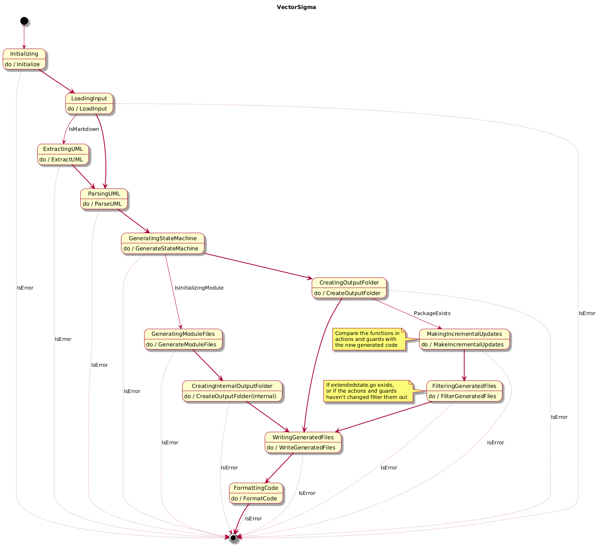

# VectorSigma

[](https://opensource.org/licenses/mit)
[](https://goreportcard.com/report/github.com/mhersson/vectorsigma)
[](https://github.com/mhersson/vectorsigma/releases)

VectorSigma is a tool designed to generate finite state machines (FSM) in Go
from UML diagrams. It supports creating standalone applications, extending
existing codebases with state machine functionality, and implementing
reconciliation loops for Kubernetes (k8s) operators. This flexibility allows
developers to easily integrate state machine logic into various types of
applications, whether starting from scratch or enhancing existing systems.

## Features

- **Standalone Applications**: Generate complete applications that incorporate
  finite state machines.
- **Extend Existing Applications**: Add state machine functionality to your
  existing applications.
- **Kubernetes Integration**: Support for reconciliation loops in Kubernetes
  operators, making it suitable for cloud-native applications.
- **Incremental Updates**: Perform updates that regenerate state machines
  without overwriting existing code. The tool intelligently adds or removes
  actions and guards based on changes in the UML diagram. See
  [Incremental Updates Documentation](docs/incremental-updates.md) for details.
- **Simple UML Syntax**: Utilize a specific
  [UML syntax](docs/vectorsigma-uml-syntax.md) to define states, transitions,
  actions, and guards, making it easy to visualize and manage state machine
  logic.
- **Markdown Support**: Extract UML diagrams directly from `plantuml` code
  blocks in Markdown files, allowing you to design your state machine while
  documenting your project.

## The state chart of VectorSigma

VectorSigma is not just a tool for generating finite state machines; it is
itself a finite state machine. The following
[state chart](docs/vectorsigma-statechart.md) illustrates the internal workings
of VectorSigma, showcasing how it processes input and transitions between
different states.



## Writing UML

For more detailed information on the UML syntax used by VectorSigma, please
refer to the
[VectorSigma UML Syntax Documentation](docs/vectorsigma-uml-syntax.md).
Additionally, you can view the
[State Chart of VectorSigma](docs/vectorsigma-statechart.md) to understand the
various states and transitions within the application. If you're looking to
deepen your understanding of state machines and state charts in general, visit
[statecharts.dev](https://statecharts.dev) for a comprehensive set of resources.

For creating UML diagrams, a good online editor to consider is
[planttext.com](https://planttext.com). Another option is my
[Markdown Preview Language Server (mpls)](https://github.com/mhersson/mpls),
which supports UML and allows you to edit UML in your favorite editor while
displaying the state chart in a browser. This can enhance your workflow and make
it easier to visualize your state machines.

## Guides and Examples

Check out these guides to help you get started:

- [Getting started guide](docs/getting-started-guide.md)
- [Building Kubernetes Operators with VectorSigma](/docs/k8s-operator-guide.md)

## Installation Instructions

If you allready have Go installed on your system, you can install VectorSigma
using the following command:

```bash
go install github.com/mhersson/vectorsigma@latest
```

If not, you can install VectorSigma by downloading the latest build from the
[releases](https://github.com/mhersson/vectorsigma/releases) page:

1. Download the appropriate tar.gz file for your operating system.
2. Extract the contents of the tar.gz file. You can do this using the following
   command in your terminal:

   ```bash
   tar xzf vectorsigma<version>_linux_amd64.tar.gz
   ```

   (Replace `<version>` with the actual version of the release.)

3. Copy the extracted binary to a directory that is in your system's PATH. For
   example:

   ```bash
   sudo cp vectorsigma /usr/local/bin/
   ```

<details>
<summary>If you otherwise prefer to build from source follow these steps</summary>

1. **Clone the repository**:

   ```bash
   git clone https://github.com/mhersson/vectorsigma.git
   cd vectorsigma
   ```

2. **Build the project**:

   Build the project using the following command:

   ```bash
   make build
   ```

   This command will compile the source code and create an executable.

3. **Install the executable**:

   You have two options to install the executable:

   - **Option 1: Copy the executable to your PATH**:

     After building, you can manually copy the executable to a directory that is
     in your system's PATH. For example:

     ```bash
     sudo cp vectorsigma /usr/local/bin/
     ```

   - **Option 2: Use `make install` if you are using GOPATH**:

     If the GOPATH is in your PATH, you can run:

     ```bash
     make install
     ```

     This will install the executable to your `$GOPATH/bin` directory.

</details>

**Verify the installation**:

After installation, you can verify that `vectorsigma` is installed correctly by
running:

```bash
vectorsigma --version
```

This should display the version of the `vectorsigma` executable. Now,
VectorSigma should be installed and ready to use.

## Usage Instructions

Below are the commands and flags you can use to operate VectorSigma.

### General Usage

To run VectorSigma, use the following command:

```bash
vectorsigma [command] [flags]
```

### Available Commands

- **completion**: Generate the autocompletion script for your shell.
- **init**: Initialize a new Go module with an FSM application generated from
  your UML diagram.

### General Flags

| Flag                   | Description                                                                                   |
| ---------------------- | --------------------------------------------------------------------------------------------- |
| `--api-kind string`    | Specify the API kind (used only when generating a k8s operator)                               |
| `--api-version string` | Specify the API version (used only when generating a k8s operator)                            |
| `-g, --group string`   | Group (only used if generating a k8s operator)                                                |
| `-h, --help`           | Show help information for VectorSigma                                                         |
| `-i, --input string`   | Provide the UML input file. This can also be a markdown file containing a plantuml code block |
| `-m, --module string`  | Set the name of the new Go module (defaults to module name from go.mod if it exists)          |
| `-O --operator`        | Generate FSM for a k8s operator                                                               |
| `-o, --output string`  | Specify the output path for the generated FSM (defaults to the current working directory)     |
| `-p, --package string` | Set the package name of the generated FSM (defaults to "statemachine")                        |
| `-v, --version`        | Display the version of VectorSigma                                                            |

### The Init Command

To initialize a new Go module with an FSM, use the following command:

```bash
vectorsigma init [flags]
```

#### Init Command Flags

| Flag                   | Description                                                                                   |
| ---------------------- | --------------------------------------------------------------------------------------------- |
| `-h, --help`           | Show help information for the init command                                                    |
| `-i, --input string`   | Provide the UML input file. This can also be a markdown file containing a plantuml code block |
| `-m, --module string`  | Set the name of the new Go module (defaults to the current directory name)                    |
| `-p, --package string` | Set the package name of the generated FSM (defaults to "statemachine")                        |

### Example Usage

To generate an FSM from a UML file, you might run:

```bash
vectorsigma --input mydiagram.uml --output internal
```

If your input is in a markdown file, you can run:

```bash
vectorsigma --input mydiagram.md --output internal
```

To initialize a new go module in the current directory (generate a default
`go.mod` and `main.go` file with the FSM)

```bash
vectorsigma init --input mydiagram.uml -m github.com/yourusername/newproject
```

To generate the reconcile loop of an k8s operator:

```bash
vectorsigma -i myreconcileloop.uml -o internal/controller --operator --group mycompany --api-version v1 --api-kind MyCRDKind
```

## Contributing

Contributions are welcome! I love pull requests, bug reports, and feature
suggestions!
