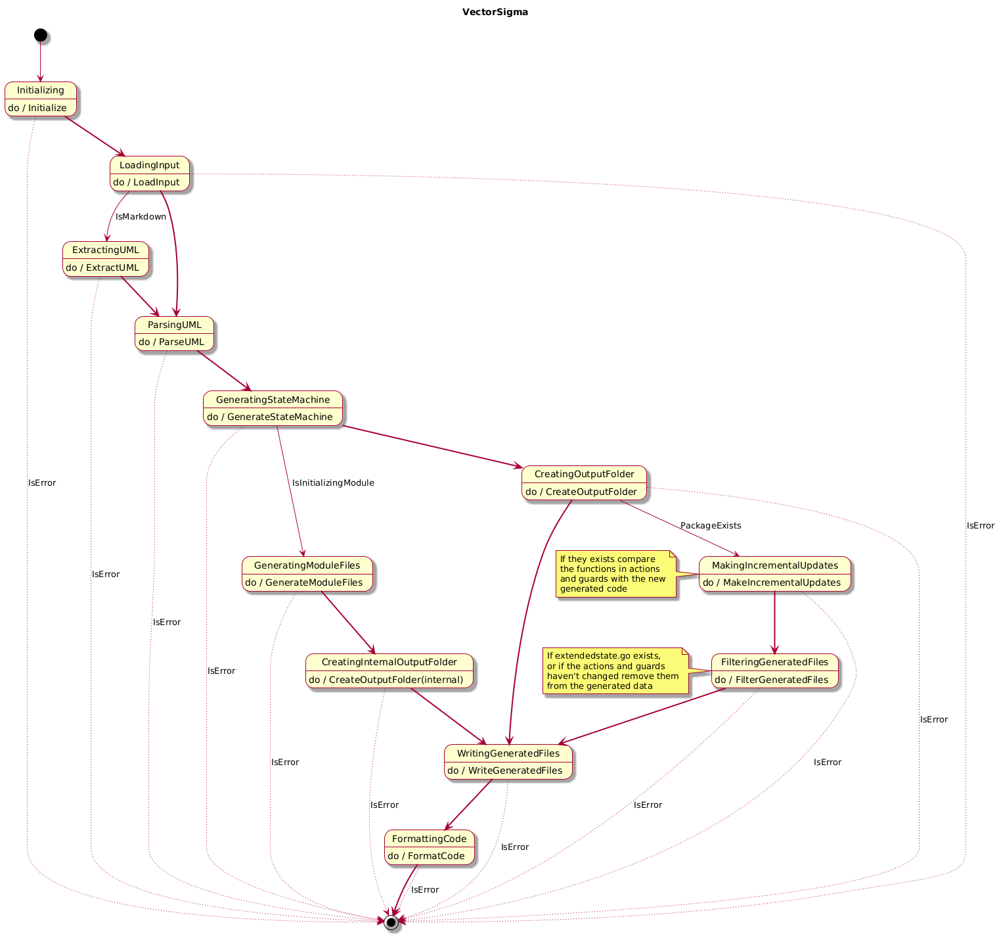

# VectorSigma

VectorSigma is a tool designed to generate finite state machines (FSM) in Go
from UML diagrams. It supports the creation of standalone applications as well
as the reconciliation loop for Kubernetes (k8s) operators.  This flexibility
allows developers to easily integrate state machine logic into various types of
applications.

## Features

- **Standalone Applications**: VectorSigma can generate standalone applications
  that incorporate finite state machines.
- **Kubernetes Integration**: It supports the reconciliation loop for Kubernetes
  operators, making it suitable for cloud-native applications.
- **Incremental Updates**: VectorSigma can perform incremental updates, allowing
  you to regenerate the state machine without overwriting existing code. It
  intelligently adds or removes actions and guards based on changes in the UML
  diagram.
- **UML Syntax Support**: VectorSigma utilizes a specific [UML
  syntax](docs/syntax.md) to define states, transitions, actions, and guards,
  making it easy to visualize and manage state machine logic.

## The state chart of VectorSigma

VectorSigma is not just a tool for generating finite state machines; it is
itself a finite state machine (FSM). The following [state
chart](docs/statechart.md) illustrates the internal workings of VectorSigma,
showcasing how it processes input and transitions between different states.



## Writing UML

For more detailed information on the UML syntax used by VectorSigma, please
refer to the [VectorSigma UML Syntax Documentation](docs/syntax.md).
Additionally, you can view the [State Chart of VectorSigma](docs/statechart.md)
to understand the various states and transitions within the application. If
you're looking to deepen your understanding of state machines and state charts
in general, visit [statecharts.dev](https://statecharts.dev) for a comprehensive
set of resources.

For creating UML diagrams, a good online editor to consider is
[planttext.com](https://planttext.com). Another option is my Markdown Preview
Language Server (mpls) project available at
[github.com/mhersson/mpls](https://github.com/mhersson/mpls), which supports UML
and allows you to edit UML in your favorite editor while displaying the state
chart in a browser. This can enhance your workflow and make it easier to
visualize your state machines.

## Installation Instructions

To install VectorSigma you can download the latest build from the
[releases](https://github.com/mhersson/vectorsigma/releases) page, or if you
prefer to build from source follow these steps:

1. Ensure you have Go installed on your machine. You can download it from
   [go.dev](https://go.dev/dl/).
2. Clone the VectorSigma repository:

   ```bash
   git clone https://github.com/mhersson/vectorsigma.git
   ```

3. Navigate to the project directory:

   ```bash
   cd vectorsigma
   ```

4. If you have `make` installed, you can simply run:

   ```bash
   make
   ```

   This will build the application and install the necessary dependencies.

   If you prefer to build manually, you can also run:

   ```bash
   go mod tidy
   go build
   ```

5. To install VectorSigma to your GOPATH, you can use:

   ```bash
   make install
   ```

   Alternatively, you can run:

   ```bash
   go install
   ```

   This will place the executable in your GOPATH's `bin` directory.

   If you do not want to use GOPATH, or if the GOPATH/bin directory is not in
   your system's PATH, you can copy the generated executable to a directory that
   is included in your system's PATH.

Now, VectorSigma should be installed and ready to use.

## Usage Instructions

Below are the commands and flags you can use to operate VectorSigma.

### General Usage

To run VectorSigma, use the following command:

```bash
vectorsigma [command] [flags]
```

### Available Commands

- **init**: Initialize a new Go module with an FSM application generated from
  your UML diagram.
- **completion**: Generate the autocompletion script for your shell.
- **help**: Display help information about any command.

### Flags

- `--api-kind string`: Specify the API kind (used only when generating a k8s
  operator).
- `--api-version string`: Specify the API version (used only when generating a
  k8s operator).
- `-h, --help`: Show help information for VectorSigma.
- `-i, --input string`: Provide the UML input file. This can also be a markdown
  file containing a plantuml code block.
- `-m, --module string`: Set the name of the new Go module (defaults to the
  current directory name).
- `--operator`: Generate FSM for a k8s operator.
- `-o, --output string`: Specify the output path for the generated FSM (defaults
  to the current working directory).
- `-p, --package string`: Set the package name of the generated FSM (defaults to
  "statemachine").
- `-v, --version`: Display the version of VectorSigma.

### The Init Command

To initialize a new Go module with an FSM, use the following command:

```
vectorsigma init [flags]
```

#### Flags for Init Command

- `-h, --help`: Show help information for the init command.
- `-i, --input string`: Provide the UML input file. This can also be a markdown
  file containing a plantuml code block.
- `-m, --module string`: Set the name of the new Go module (defaults to the
  current directory name).
- `-p, --package string`: Set the package name of the generated FSM (defaults to
  "statemachine").

### Example Usage

To generate an FSM from a UML file, you might run:

```bash
vectorsigma -i mydiagram.uml -o ./output
```

If your input is in a markdown file, you can run:

```bash
vectorsigma -i myfile.md -o ./output
```

To initialize a new go module in the current directory (generate a default
`go.mod` and `main.go` file with the FSM)

```bash
vectorsigma init -i mydiagram.uml
```

To generate the reconcile loop of an k8s operator:

```bash
vectorsigma -i myreconcileloop.uml -o internal/controller --operator --api-version v1 --api-kind MyCRDKind
```
