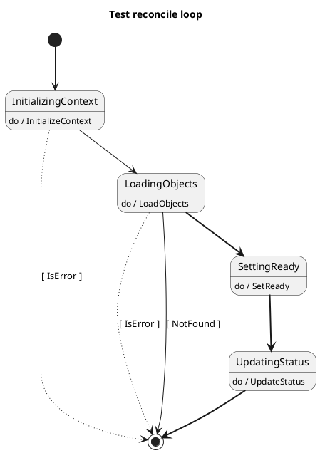

# k8s operator - reconcile loop

```plantuml
@startuml

title Test reconcile loop

[*] --> InitializingContext
InitializingContext: do / InitializeContext
InitializingContext -[dotted]-> [*]: [ IsError ]
InitializingContext --> LoadingObjects

LoadingObjects: do / LoadObjects
LoadingObjects -[dotted]-> [*]: [ IsError ]
LoadingObjects --> [*]: [ NotFound ]
LoadingObjects -[bold]->  SettingReady

SettingReady: do / SetReady
SettingReady -[bold]-> UpdatingStatus

UpdatingStatus: do / UpdateStatus
UpdatingStatus -[bold]-> [*]

@enduml
```
