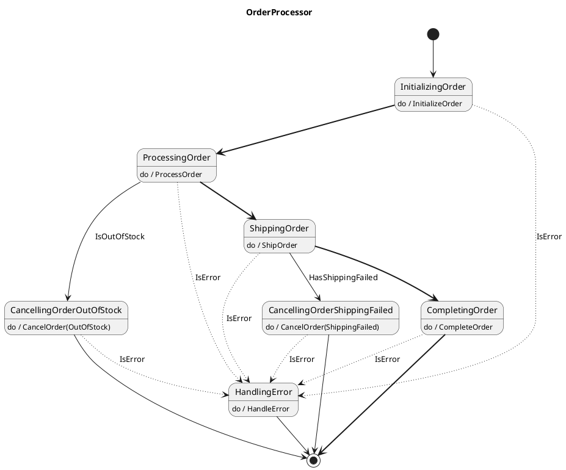

# Getting Started with VectorSigma

This guide will walk you through creating your first finite state machine (FSM)
with VectorSigma. We'll build a simple application that processes orders through
various states from creation to completion.

## Prerequisites

Before starting, make sure you have:

- Go (v1.20+) installed
- VectorSigma installed (follow the
  [Installation Instructions](../README.md#installation-instructions))

## Step 1: Design Your State Machine

First, let's design a simple order processing state machine with the following
states:

- InitializingOrder: Initial state when an order is created
- ProcessingOrder: Preparing the order
- ShippingOrder: Order is being shipped
- CompletingOrder: Order has been delivered
- CancellingOrder(OutOfStock/ShippingFailed): Order has been cancelled (Multiple
  states executing same action with different parameter)

Create a file named `order_processor.uml` with the following content:



This UML diagram defines our state machine with proper states, transitions, and
actions.

## Step 2: Generate the State Machine

Now, let's use VectorSigma to generate a Go application from our UML diagram:

```bash
# Create a new directory for our project
mkdir order-processor
cd order-processor

# Initialize a new Go application with our state machine
vectorsigma init -i ../order_processor.uml -m github.com/yourusername/order-processor
```

VectorSigma will:

1. Create a new Go module
2. Generate the state machine code
3. Set up a basic application structure

## Step 3: Explore the Generated Code

Let's examine the files VectorSigma created:

```plaintext
order-processor/
├── go.mod               # Go module definition
├── main.go              # Main application entry point
└── internal/            # Internal packages directory
    └── statemachine/    # Generated state machine package
        ├── actions.go       # Action implementations
        ├── actions_test.go  # Tests for actions
        ├── extendedstate.go # State machine context
        ├── guards.go        # Guard condition implementations
        ├── guards_test.go   # Tests for guards
        ├── zz_generated_statemachine.go        # Generated state machine
        └── zz_generated_statemachine_test.go   # Tests for state machine
```

The most important files to understand are:

- `actions.go`: Contains stubs for all the actions you defined in your UML
- `guards.go`: Contains stubs for all the guard conditions you defined
- `extendedstate.go`: Defines the context that your state machine operates on
- `actions_test.go` and `guards_test.go`: Test stubs for your actions and guards
- `zz_generated_statemachine.go`: The generated state machine implementation
- `zz_generated_statemachine_test.go`: Tests for the generated state machine

In a real-world scenario, you would typically write tests for your actions and
guards before implementing them (test-driven development). For this guide, we'll
focus on implementation and skip writing tests for brevity, but it's worth
noting that the generated test file for the state machine
(`zz_generated_statemachine_test.go`) is fully functional and can be run
immediately.

## Understanding Error Handling and Execution Flow

### Error Handling Strategy

VectorSigma implements error handling through a specific pattern that separates
system errors from normal application flow:

1. **System Errors vs. Normal Flow**

   - System errors refer to unexpected conditions like database failures,
     network errors, or runtime exceptions
   - Normal flow conditions are expected decision points that direct your state
     machine based on domain logic

2. **The IsError Guard Pattern**

   - Notice in our UML that every state has an
     `-[dotted]-> HandlingError: IsError` transition
   - This is a best practice that provides a consistent escape hatch for system
     errors

3. **How Errors Are Detected** In the `guards.go` file, the `IsError` guard
   looks like:

   ```go
   // +vectorsigma:guard:IsError
   func (fsm *OrderProcessor) IsErrorGuard() bool {
       return fsm.ExtendedState.Error != nil
   }
   ```

   If any action sets `fsm.ExtendedState.Error`, the machine will transition to
   the error handling state.

4. **Why Our Example Won't Have Errors** In our order processor example, we're
   simply simulating the processing flow, so actions won't encounter real system
   errors. In a production system, actions might:

   - Fail to contact external services (payment gateways, shipping APIs)
   - Encounter database transaction failures
   - Hit rate limits or timeouts

   In these cases, actions would set `fsm.ExtendedState.Error` and the `IsError`
   guard would trigger.

## Parameterized Actions

VectorSigma supports passing parameters to actions, which is especially useful
when similar actions need context-specific information. Notice in our UML:

```plaintext
CancellingOrderOutOfStock: do / CancelOrder(OutOfStock)
CancellingOrderShippingFailed: do / CancelOrder(ShippingFailed)
```

Both states execute the same action but with different parameters. Here's how it
works:

1. **In UML**: Parameters are specified in parentheses after the action name.
   Multiple parameters are separated by a comma.

2. **In Generated Code**: All action methods receive parameters as variadic
   strings:

   ```go
   // +vectorsigma:action:CancelOrder
   func (fsm *OrderProcessor) CancelOrderAction(params ...string) error {
       if len(params) > 0 {
           switch params[0] {
           case "OutOfStock":
               fsm.ExtendedState.CancelReason = "item is out of stock"
           case "ShippingFailed":
               fsm.ExtendedState.CancelReason = "shipping failed"
           default:
               fsm.ExtendedState.CancelReason = "unknown"
           }
       }

       fsm.Context.Logger.Info("Cancelling order",
           "id", fsm.ExtendedState.Order.ID,
           "reason", fsm.ExtendedState.CancelReason)

       // Update status
       fsm.ExtendedState.Order.Status = "Cancelled"

       return nil
   }
   ```

3. **Benefits**:

   - Reduces code duplication
   - Centralizes related logic
   - Makes state machines more maintainable

4. **Best Practice**: Use parameters when multiple states need to perform
   similar actions with slight variations or contextual information.

## Step 4: Implement the Extended State

> **Note on State Machine Execution Order**: In VectorSigma state machines,
> actions always run _before_ guards in each state. This means that actions
> perform their work first, potentially modifying the ExtendedState, and then
> guards evaluate conditions based on the updated state to determine the next
> transition. This execution order is crucial to understand when implementing
> your actions and guards.
>
> **Note on ExtendedState Design Pattern**: According to the comment in
> `extendedstate.go`, the ExtendedState should only be modified by actions,
> while guards should only read it to determine transitions. This separation of
> concerns, combined with the execution order (actions before guards), creates a
> clean flow where actions perform operations and update state, then guards use
> that state to determine the next transition.

First, let's update `internal/statemachine/extendedstate.go` to define what an
order looks like:

```go
package statemachine

import (
    "log/slog"
)

// A struct that holds the items needed for the actions to do their work.
// Things like client libraries and loggers, go here.
type Context struct {
    Logger *slog.Logger // Do NOT delete this!
}

// A struct that holds the "extended state" of the state machine, including data
// being fetched and read. This should only be modified by actions, while guards
// should only read the extended state to assess their value.
type ExtendedState struct {
    Error error

    // Custom field for our order processor
    Order        Order
    CancelReason string
}

// Order represents an order in our system
type Order struct {
    ID          string
    CustomerID  string
    Items       []OrderItem
    TotalAmount float64
    Status      string
}

// OrderItem represents an item in an order
type OrderItem struct {
    ProductID string
    Quantity  int
    Price     float64
    IsInStock bool
}

```

## The State Machine Execution Cycle

Understanding how VectorSigma state machines execute is essential for effective
implementation:

1. **State Entry**: The state machine enters a state (e.g., ProcessingOrder)
2. **Action Execution**: The state's action runs first (e.g.,
   ProcessOrder)
3. **Guard Evaluation**: After the action completes, guards are evaluated in
   order
4. **Transition Selection**: The first guard that returns true determines the
   next state
5. **Default Path**: If no guards return true, the unguarded transition is taken

This execution cycle means that guards don't validate input conditions for an
action - instead, they validate the outcome of actions that have already run.
Actions should set appropriate status information in the ExtendedState to help
guards make decisions about state transitions.

## Step 5: Implement Actions and Guards

Now, let's implement the actions in `internal/statemachine/actions.go`:

```go
package statemachine

import "time"

// +vectorsigma:action:InitializeOrder
func (fsm *OrderProcessor) InitializeOrderAction(_ ...string) error {
    fsm.Context.Logger.Info("Initializing new order", "id", fsm.ExtendedState.Order.ID)

    // Set initial status
    fsm.ExtendedState.Order.Status = "New"

    return nil
}

// +vectorsigma:action:ProcessOrder
func (fsm *OrderProcessor) ProcessOrderAction(_ ...string) error {
    fsm.Context.Logger.Info("Processing order", "id", fsm.ExtendedState.Order.ID)

    // Process order
    // In a real application, some database queries or external calls to other
    // systems might happen here. Things that might cause an error.

    // Note: This action runs before IsOutOfStock guard
    for i, item := range fsm.ExtendedState.Order.Items {
        // Simulate processing time
        time.Sleep(100 * time.Millisecond)
        fsm.Context.Logger.Info("Processed item", "productId", item.ProductID)

        // Update item in the order
        fsm.ExtendedState.Order.Items[i] = item
    }

    // Update status
    fsm.ExtendedState.Order.Status = "Processed"

    return nil
}

// +vectorsigma:action:ShipOrder
func (fsm *OrderProcessor) ShipOrderAction(_ ...string) error {
    fsm.Context.Logger.Info("Shipping order", "id", fsm.ExtendedState.Order.ID)

    // Simulate shipping process
    time.Sleep(500 * time.Millisecond)

    // Update status
    fsm.ExtendedState.Order.Status = "Shipped"

    return nil
}

// +vectorsigma:action:CompleteOrder
func (fsm *OrderProcessor) CompleteOrderAction(_ ...string) error {
    fsm.Context.Logger.Info("Completing order", "id", fsm.ExtendedState.Order.ID)

    // Update status
    fsm.ExtendedState.Order.Status = "Completed"

    return nil
}

// +vectorsigma:action:CancelOrder
func (fsm *OrderProcessor) CancelOrderAction(params ...string) error {
    if len(params) > 0 {
        switch params[0] {
        case "OutOfStock":
            fsm.ExtendedState.CancelReason = "item is of out stock"
        default:
            fsm.ExtendedState.CancelReason = "unknown"
        }
    }

    fsm.Context.Logger.Info("Cancelling order",
        "id", fsm.ExtendedState.Order.ID,
        "reason", fsm.ExtendedState.CancelReason)

    // Update status
    fsm.ExtendedState.Order.Status = "Cancelled"

    return nil
}

// +vectorsigma:action:HandleError
func (fsm *OrderProcessor) HandleErrorAction(_ ...string) error {
    fsm.Context.Logger.Info("Handling error",
        "id", fsm.ExtendedState.Order.ID,
        "error", fsm.ExtendedState.Error)

    // In a real application, we might actually do something here

    // Update status
    fsm.ExtendedState.Order.Status = "Failed"

    return nil
}

```

Next, implement the guards in `internal/statemachine/guards.go`:

```go
package statemachine

// +vectorsigma:guard:HasShippingFailed
func (fsm *OrderProcessor) HasShippingFailedGuard() bool {
    // In a real application, this would check if the ShipOrderAction
    // encountered an error during shipping
    return false
}

// +vectorsigma:guard:IsError
func (fsm *OrderProcessor) IsErrorGuard() bool {
    // In a real application, this could happen, but no system errors
    // will occur in this application
    return fsm.ExtendedState.Error != nil
}

// +vectorsigma:guard:IsOutOfStock
func (fsm *OrderProcessor) IsOutOfStockGuard() bool {
    // Check if any items are out of stock
    for _, item := range fsm.ExtendedState.Order.Items {
        if !item.IsInStock {
            return true
        }
    }

    return false
}
```

## Step 6: Update the Main Application

Now, let's update the `main.go` file to use our state machine:

```go
package main

import (
    "fmt"

    "github.com/yourusername/order-processor/internal/statemachine"
)

func main() {
    // Create a successful order
    successfulOrder := createSuccessfulOrder()
    processOrder(successfulOrder, "Successful Order")

    fmt.Println("------------------------")

    // Create an invalid order (out of stock)
    invalidOrder := createOutOfStockOrder()
    processOrder(invalidOrder, "Out Of Stock Order")
}

func processOrder(order statemachine.Order, label string) {
    fmt.Printf("Processing %s:\n", label)

    // Initialize the state machine
    sm := statemachine.New()

    // Set the order data
    sm.ExtendedState.Order = order

    // Run the state machine
    fmt.Printf("Starting state machine for order %s\n", order.ID)
    err := sm.Run()
    if err != nil {
        panic(err)
    }

    fmt.Printf("Final order status: %s\n", sm.ExtendedState.Order.Status)
}

func createSuccessfulOrder() statemachine.Order {
    return statemachine.Order{
        ID:         "ORD-001",
        CustomerID: "CUST-001",
        Items: []statemachine.OrderItem{
            {
                ProductID: "PROD-001",
                Quantity:  2,
                Price:     19.99,
                IsInStock: true,
            },
            {
                ProductID: "PROD-002",
                Quantity:  1,
                Price:     29.99,
                IsInStock: true,
            },
        },
        TotalAmount: 69.97,
        Status:      "New",
    }
}

func createOutOfStockOrder() statemachine.Order {
    return statemachine.Order{
        ID:         "ORD-002",
        CustomerID: "CUST-002",
        Items: []statemachine.OrderItem{
            // This item is out of stock and will be caught
            // by the IsOutOfStock guard and cancelled
            {
                ProductID: "PROD-001",
                Quantity:  2,
                Price:     19.99,
                IsInStock: false,
            },
        },
        TotalAmount: 0,
        Status:      "New",
    }
}

```

## Step 7: Run the Application and Tests

First, let's run the state machine tests to see the built-in test coverage:

```bash
go test -v ./... --coverprofile=cover.out
```

You should see that the tests pass with good coverage. The generated test file
(`zz_generated_statemachine_test.go`) automatically tests the state machine's
transitions, providing over 50% code coverage even before you write a single
test for your actions and guards.

Now, let's run our application:

```bash
go run main.go
```

You should see output showing the state machine transitions as it processes both
orders:

- The successful order should flow through all states to completion
- The invalid order should fail validation and transition to the CancellingOrder
  state

You can enable debug mode to see more detailed state transitions by setting the
environment variable:

```bash
ORDERPROCESSOR_DEBUG=1 go run main.go
```

This will output additional information about state transitions, which is useful
for troubleshooting and understanding the execution flow.

In a real project, you would also implement tests for your actions and guards in
the provided test files, but we've skipped that here for brevity.

## Best Practices for State Machine Design

### Handling Recurring and Looping Processes

When designing state machines for recurring processes (like a traffic light
controller), follow these guidelines:

1. **Avoid Infinite Loops in State Machines** Instead of designing state
   machines with internal loops that never terminate, prefer this approach:

   ```go
   // External loop pattern - better for testing and control
   func main() {
       trafficLight := statemachine.New()

       // Run in a controlled loop where you can stop, inspect state, etc.
       for {
           err := trafficLight.Run()
           if err != nil {
               log.Printf("Traffic light error: %v", err)
               // Handle error, maybe sleep and retry
           }

           // This external loop gives you control for:
           // - Graceful shutdown
           // - Error recovery
           // - State inspection between cycles
           // - Testing a single cycle easily

           time.Sleep(100 * time.Millisecond)
       }
   }
   ```

2. **Design for Testability**

   - Make each run of the state machine complete to a final state
   - For cyclic processes, handle the looping logic in Go code, not in the state
     machine
   - This makes unit testing straightforward as you can test a single, complete
     cycle

## Step 8: Making Changes to Your State Machine

Let's say you want to add a new state to your state machine. For example, you
might want to add a "ProcessingPayment" state before shipping the order.

1. Update your UML diagram (`order_processor.uml`):

   ```plantuml
    @startuml

    title OrderProcessor

    [*] --> InitializingOrder

    InitializingOrder: do / InitializeOrder
    InitializingOrder -[dotted]-> HandlingError: IsError
    InitializingOrder -[bold]-> ProcessingOrder

    ProcessingOrder: do / ProcessOrder
    ProcessingOrder -[dotted]-> HandlingError: IsError
    ProcessingOrder --> CancellingOrderOutOfStock: IsOutOfStock
    ProcessingOrder -[bold]-> ProcessingPayment

    ProcessingPayment: do / ProcessPayment
    ProcessingPayment -[dotted]-> HandlingError: IsError
    ProcessingPayment --> CancellingOrderPaymentFailed: HasPaymentFailed
    ProcessingPayment -[bold]-> ShippingOrder

    ShippingOrder: do / ShipOrder
    ShippingOrder -[dotted]-> HandlingError: IsError
    ShippingOrder --> CancellingOrderShippingFailed: HasShippingFailed
    ShippingOrder -[bold]-> CompletingOrder

    CancellingOrderPaymentFailed: do / CancelOrder(PaymentFailed)
    CancellingOrderPaymentFailed -[dotted]-> HandlingError: IsError
    CancellingOrderPaymentFailed --> [*]

    CancellingOrderOutOfStock: do / CancelOrder(OutOfStock)
    CancellingOrderOutOfStock -[dotted]-> HandlingError: IsError
    CancellingOrderOutOfStock --> [*]

    CancellingOrderShippingFailed: do / CancelOrder(ShippingFailed)
    CancellingOrderShippingFailed -[dotted]-> HandlingError: IsError
    CancellingOrderShippingFailed --> [*]

    CompletingOrder: do / CompleteOrder
    CompletingOrder -[dotted]-> HandlingError: IsError
    CompletingOrder -[bold]-> [*]

    HandlingError: do / HandleError
    HandlingError --> [*]

    @enduml
   ```

2. Regenerate the state machine:

   **Note:** Now our application already exists, so we run `vectorsigma` without
   the `init` command, but instead we have to add the output directory. Our
   `statemachine` package resides in the `internal` directory, and that is what
   we set as output here.

   ```bash
   vectorsigma -i order_processor.uml -m github.com/yourusername/order-processor -o internal
   ```

3. VectorSigma will update the generated files without overwriting your custom
   implementations. It will:

   - Update the state machine definition
   - Generate stubs for the new actions and guards
   - Preserve your existing code for actions and guards

4. Now you can implement the new action and guard:

   - Complete the `ProcessPaymentAction` method in `actions.go`
   - Complete the `HasPaymentFailedGuard` method in `guards.go`
   - Add a new case to the switch statement in `CancelOrderAction`

5. (Optional) Write unit tests for all actions and guards to see how high test
   coverage you get

## Conclusion

Congratulations! You've created your first state machine with VectorSigma. This
guide showed you how to:

1. Design a state machine using UML
2. Generate code with VectorSigma
3. Implement action methods and guard conditions
4. Create a simple application using the state machine
5. Make changes to the state machine

From here, you can:

- Create more complex state machines
- Integrate state machines into larger applications

For more advanced use cases, check out the other guides such as
[Building Kubernetes Operators with VectorSigma](/docs/k8s-operator-guide.md)
