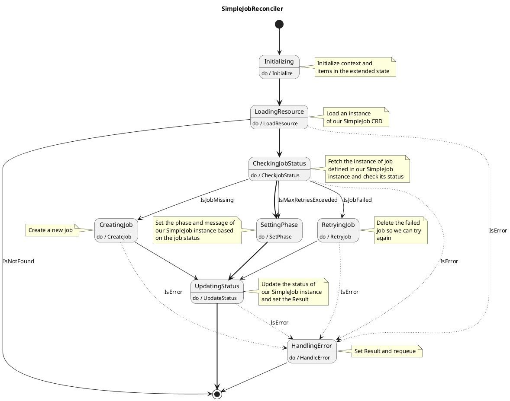

# Building Kubernetes Operators with VectorSigma

This guide walks you through creating a Kubernetes operator using VectorSigma to
implement the reconciliation loop as a finite state machine (FSM). We'll build a
"SimpleJob" operator that manages jobs with automatic retries and status
tracking.

> **Important Note:** This guide assumes you have prior knowledge of Kubernetes
> operators and Kubernetes concepts in general. It is not intended as an
> introduction to operator development or Kubernetes architecture. Readers
> should be familiar with:
>
> - Basic Kubernetes concepts (pods, deployments, CRDs, etc.)
> - The operator pattern and reconciliation loops
>
> However, this is a comprehensive step-by-step guide where you can follow along
> by copying and pasting each command to create a fully functional operator with
> a FSM-based reconciliation loop generated by VectorSigma. Even with limited
> operator experience, you can successfully complete this guide if you have the
> foundational Kubernetes knowledge mentioned above.

## Prerequisites

Before starting, make sure you have:

- Go (v1.20+)
- Docker
- kubectl
- kind (for local Kubernetes development)
- kubebuilder
- VectorSigma installed

## Step 1: Set Up the Development Environment

First, let's create a new local Kubernetes cluster for testing:

```bash
# Create a new kind cluster
kind create cluster --name vectorsigma-demo

# Verify the cluster is running
kubectl cluster-info --context kind-vectorsigma-demo
```

## Step 2: Create a New Operator Project with Kubebuilder

Next, let's create a new operator project using Kubebuilder:

```bash
# Create a directory for your project
mkdir simplejob-operator
cd simplejob-operator

# Initialize a new kubebuilder project
kubebuilder init --domain example.com --repo github.com/example/simplejob-operator

# Create a new API and controller
kubebuilder create api --group jobs --version v1alpha1 --kind SimpleJob --resource=true --controller=true
```

## Step 3: Define the Custom Resource

Let's update the SimpleJob API to include the fields we need. Edit the file
`api/v1alpha1/simplejob_types.go`:

```go
package v1alpha1

import (
    metav1 "k8s.io/apimachinery/pkg/apis/meta/v1"
)

// SimpleJobSpec defines the desired state of SimpleJob
type SimpleJobSpec struct {
    // Command to run in the job
    Command string `json:"command"`

    // Image to use for the job
    Image string `json:"image"`

    // Maximum number of retries before marking the job as failed
    MaxRetries int32 `json:"maxRetries,omitempty"`
}

// SimpleJobStatus defines the observed state of SimpleJob
type SimpleJobStatus struct {
    // Current phase of the job
    Phase string `json:"phase,omitempty"`

    // Number of attempts made
    Attempts int32 `json:"attempts,omitempty"`

    // Message contains additional information about the job's status
    Message string `json:"message,omitempty"`

    // StartTime represents the time when the job started executing
    StartTime *metav1.Time `json:"startTime,omitempty"`

    // CompletionTime represents the time when the job completed successfully
    CompletionTime *metav1.Time `json:"completionTime,omitempty"`
}

// +kubebuilder:object:root=true
// +kubebuilder:subresource:status
// +kubebuilder:printcolumn:name="Phase",type="string",JSONPath=".status.phase"
// +kubebuilder:printcolumn:name="Attempts",type="integer",JSONPath=".status.attempts"
// +kubebuilder:printcolumn:name="Age",type="date",JSONPath=".metadata.creationTimestamp"
// +kubebuilder:printcolumn:name="Message",type="string",JSONPath=".status.message"
// +kubebuilder:printcolumn:name="Completed",type="string",JSONPath=".status.completionTime"

// SimpleJob is the Schema for the simplejobs API
type SimpleJob struct {
    metav1.TypeMeta   `json:",inline"`
    metav1.ObjectMeta `json:"metadata,omitempty"`

    Spec   SimpleJobSpec   `json:"spec,omitempty"`
    Status SimpleJobStatus `json:"status,omitempty"`
}

// +kubebuilder:object:root=true

// SimpleJobList contains a list of SimpleJob
type SimpleJobList struct {
    metav1.TypeMeta `json:",inline"`
    metav1.ListMeta `json:"metadata,omitempty"`
    Items           []SimpleJob `json:"items"`
}

func init() {
    SchemeBuilder.Register(&SimpleJob{}, &SimpleJobList{})
}
```

Now run the following command to update the generated code:

```bash
make generate
make manifests
```

## Step 4: Design the State Machine

Let's design a state machine for our SimpleJob reconciliation process. Create a
file called `simplejob_reconciler.uml` with the following content:



## Step 5: Generate the State Machine with VectorSigma

Let's use VectorSigma to generate our state machine: Please note that
`--api-kind` is case sensitive, so `Simplejob` and `SimpleJob` are not the same.
Be sure to write exactly as you did in
[step 2](#step-2-create-a-new-operator-project-with-kubebuilder)

```bash
# From the project root directory
vectorsigma -i simplejob_reconciler.uml -m github.com/example/simplejob-operator -o internal/controller --operator --group jobs --api-version=v1alpha1 --api-kind=SimpleJob
```

VectorSigma will generate the following files:

```plaintext
internal/controller/statemachine/
├── actions.go
├── actions_test.go
├── extendedstate.go
├── guards.go
├── guards_test.go
├── zz_generated_statemachine.go
└── zz_generated_statemachine_test.go
```

## Step 6: Implement Extended State

First, let's set up the extended state. Edit
`internal/controller/statemachine/extendedstate.go`:

```go
package statemachine

import (
    "log/slog"

    jobsv1alpha1 "github.com/example/simplejob-operator/api/v1alpha1"
    batchv1 "k8s.io/api/batch/v1"
    "k8s.io/apimachinery/pkg/types"
    ctrl "sigs.k8s.io/controller-runtime"
    "sigs.k8s.io/controller-runtime/pkg/client"
)

// A struct that holds the items needed for the actions to do their work.
// Things like client libraries and loggers, go here.
type Context struct {
    Logger *slog.Logger
    Client client.Client
}

// A struct that holds the "extended state" of the state machine, including data
// being fetched and read. This should only be modified by actions, while guards
// should only read the extended state to assess their value.
type ExtendedState struct {
    Error        error
    Result       ctrl.Result
    ResourceName types.NamespacedName
    Instance     jobsv1alpha1.SimpleJob

    // Job represents the Kubernetes Job resource
    Job *batchv1.Job
}
```

## Step 7: Implement the Actions

Now, let's implement the actions for our state machine. Edit
`internal/controller/statemachine/actions.go`:

```go
package statemachine

import (
    "context"
    "fmt"
    "time"

    jobsv1alpha1 "github.com/example/simplejob-operator/api/v1alpha1"
    batchv1 "k8s.io/api/batch/v1"
    corev1 "k8s.io/api/core/v1"
    "k8s.io/apimachinery/pkg/api/errors"
    metav1 "k8s.io/apimachinery/pkg/apis/meta/v1"
    "k8s.io/apimachinery/pkg/types"
    ctrl "sigs.k8s.io/controller-runtime"
)

// +vectorsigma:action:CheckJobStatus
func (fsm *SimpleJobReconciler) CheckJobStatusAction(_ ...string) error {
    fsm.Context.Logger.Info("Checking job status", "name", fsm.ExtendedState.ResourceName)

    // Construct the job name based on SimpleJob name
    jobName := types.NamespacedName{
        Namespace: fsm.ExtendedState.ResourceName.Namespace,
        Name:      fsm.ExtendedState.ResourceName.Name,
    }

    // Fetch the Job instance
    job := &batchv1.Job{}

    err := fsm.Context.Client.Get(context.TODO(), jobName, job)
    if err != nil {
        if errors.IsNotFound(err) {
            // Job does not exist, we need to create it
            fsm.Context.Logger.Info("Job does not exist, needs to be created", "jobName", jobName)
            fsm.ExtendedState.Job = nil

            return nil
        }

        // Error fetching the job
        return fmt.Errorf("failed to get Job: %w", err)
    }

    // Store the job in our extended state
    fsm.ExtendedState.Job = job

    // Log job status
    fsm.Context.Logger.Info("Job status",
        "jobName", jobName,
        "active", job.Status.Active,
        "succeeded", job.Status.Succeeded,
        "failed", job.Status.Failed)

    return nil
}

// +vectorsigma:action:CreateJob
func (fsm *SimpleJobReconciler) CreateJobAction(_ ...string) error {
    fsm.Context.Logger.Info("Creating job", "name", fsm.ExtendedState.ResourceName)

    // Create a new Job based on SimpleJob spec
    job := fsm.createJob()

    // Create the Job
    err := fsm.Context.Client.Create(context.TODO(), job)
    if err != nil {
        return fmt.Errorf("failed to create Job: %w", err)
    }

    // Store the job in our extended state
    fsm.ExtendedState.Job = job

    // Increment the attempts counter
    fsm.ExtendedState.Instance.Status.Attempts++

    return nil
}

// +vectorsigma:action:HandleError
func (fsm *SimpleJobReconciler) HandleErrorAction(_ ...string) error {
    // Here you would maybe do some cleanup, send events, etc. In this example
    // we are just turning off the requeue mechanism. In a real-world scenario,
    // you would want to requeue, and instead maybe add a backoff mechanism.
    fsm.ExtendedState.Result = ctrl.Result{}

    return nil
}

// +vectorsigma:action:Initialize
func (fsm *SimpleJobReconciler) InitializeAction(_ ...string) error {
    // Use the this action to initialize the context and extended state
    fsm.ExtendedState.Instance = jobsv1alpha1.SimpleJob{}

    return nil
}

// +vectorsigma:action:LoadResource
func (fsm *SimpleJobReconciler) LoadResourceAction(_ ...string) error {
    fsm.Context.Logger.Info("Loading SimpleJob resource", "name", fsm.ExtendedState.ResourceName)

    // Load the SimpleJob instance
    err := fsm.Context.Client.Get(context.TODO(), fsm.ExtendedState.ResourceName, &fsm.ExtendedState.Instance)
    if err != nil {
        if errors.IsNotFound(err) {
            // The resource doesn't exist anymore, nothing to do
            fsm.Context.Logger.Info("SimpleJob resource not found, it may have been deleted")

            return nil
        }

        // Error loading the resource
        return fmt.Errorf("failed to get SimpleJob: %w", err)
    }

    return nil
}

// +vectorsigma:action:SetPhase
func (fsm *SimpleJobReconciler) SetPhaseAction(_ ...string) error {
    job := fsm.ExtendedState.Job

    // Set the phase and message based on job status
    switch {
    case job.Status.Succeeded > 0:
        fsm.Context.Logger.Info("Job succeeded", "jobName", job.Name)
        fsm.ExtendedState.Instance.Status.Phase = "Completed"
        fsm.ExtendedState.Instance.Status.Message = "Job completed successfully"
    case job.Status.Failed > 0 || fsm.ExtendedState.Instance.Status.Attempts >= getMaxRetries(&fsm.ExtendedState.Instance):
        fsm.Context.Logger.Info("Job failed", "jobName", job.Name)
        fsm.ExtendedState.Instance.Status.Phase = "Failed"
        fsm.ExtendedState.Instance.Status.Message = "Job failed"
    case job.Status.Active > 0:
        fsm.Context.Logger.Info("Job is running", "jobName", job.Name)
        fsm.ExtendedState.Instance.Status.Phase = "Running"
        fsm.ExtendedState.Instance.Status.Message = "Job is running"
    default:
        fsm.Context.Logger.Info("Job is pending", "jobName", job.Name)
        fsm.ExtendedState.Instance.Status.Phase = "Pending"
        fsm.ExtendedState.Instance.Status.Message = "Job is pending or being created"
    }

    return nil
}

// +vectorsigma:action:RetryJob
func (fsm *SimpleJobReconciler) RetryJobAction(_ ...string) error {
    fsm.Context.Logger.Info("Retrying job", "name", fsm.ExtendedState.ResourceName)

    // Delete the existing job
    if fsm.ExtendedState.Job != nil {
        err := fsm.Context.Client.Delete(context.TODO(), fsm.ExtendedState.Job)
        if err != nil && !errors.IsNotFound(err) {
            return fmt.Errorf("failed to delete failed Job: %w", err)
        }
    }

    // Increment the attempts counter
    fsm.ExtendedState.Instance.Status.Attempts++

    // The job will be recreated in the next reconciliation
    fsm.Context.Logger.Info("Job deleted for retry",
        "name", fsm.ExtendedState.ResourceName,
        "attempts", fsm.ExtendedState.Instance.Status.Attempts)

    return nil
}

// +vectorsigma:action:UpdateStatus
func (fsm *SimpleJobReconciler) UpdateStatusAction(_ ...string) error {
    var needsCompletionTime bool

    // For simplicity we are using a fixed requeue time here, and 3 seconds is a
    // fitting value in this case to show the different phases. We will turn it
    // off after successful job completion or max retries exceeded.
    fsm.ExtendedState.Result = ctrl.Result{Requeue: true, RequeueAfter: 3 * time.Second}

    if fsm.ExtendedState.Instance.Status.Phase == "Completed" || fsm.ExtendedState.Instance.Status.Phase == "Failed" {
        // Job is completed or failed, no need to requeue
        fsm.ExtendedState.Result = ctrl.Result{}
        needsCompletionTime = true
    }

    // Set completion time if needed and not already set
    if needsCompletionTime && fsm.ExtendedState.Instance.Status.CompletionTime == nil {
        now := metav1.NewTime(time.Now())
        fsm.ExtendedState.Instance.Status.CompletionTime = &now
    }

    // Update the SimpleJob resource
    err := fsm.Context.Client.Status().Update(context.TODO(), &fsm.ExtendedState.Instance)
    if err != nil {
        fsm.ExtendedState.Error = fmt.Errorf("failed to update SimpleJob status: %w", err)
        return fsm.ExtendedState.Error
    }

    return nil
}

// Helper function to create a Job based on SimpleJob spec
func (fsm *SimpleJobReconciler) createJob() *batchv1.Job {
    return &batchv1.Job{
        ObjectMeta: metav1.ObjectMeta{
            Name:      fsm.ExtendedState.ResourceName.Name,
            Namespace: fsm.ExtendedState.ResourceName.Namespace,
            OwnerReferences: []metav1.OwnerReference{
                {
                    APIVersion: fsm.ExtendedState.Instance.APIVersion,
                    Kind:       fsm.ExtendedState.Instance.Kind,
                    Name:       fsm.ExtendedState.Instance.Name,
                    UID:        fsm.ExtendedState.Instance.UID,
                    Controller: &[]bool{true}[0],
                },
            },
        },
        Spec: batchv1.JobSpec{
            BackoffLimit: &[]int32{0}[0], // We manage retries ourselves
            Template: corev1.PodTemplateSpec{
                Spec: corev1.PodSpec{
                    RestartPolicy: corev1.RestartPolicyNever,
                    Containers: []corev1.Container{
                        {
                            Name:    "job",
                            Image:   fsm.ExtendedState.Instance.Spec.Image,
                            Command: []string{"/bin/sh", "-c", fsm.ExtendedState.Instance.Spec.Command},
                        },
                    },
                },
            },
        },
    }
}

// Helper function to get max retries with default
func getMaxRetries(instance *jobsv1alpha1.SimpleJob) int32 {
    if instance.Spec.MaxRetries > 0 {
        return instance.Spec.MaxRetries
    }

    return 3 // Default to 3 retries
}
```

## Step 8: Implement the Guards

Now, let's implement the guards for our state machine. Edit
`internal/controller/statemachine/guards.go`:

```go
package statemachine

// +vectorsigma:guard:IsError
func (fsm *SimpleJobReconciler) IsErrorGuard() bool {
    return fsm.ExtendedState.Error != nil
}

// +vectorsigma:guard:IsJobFailed
func (fsm *SimpleJobReconciler) IsJobFailedGuard() bool {
    if fsm.ExtendedState.Job == nil {
        return false
    }

    return fsm.ExtendedState.Job.Status.Failed > 0
}

// +vectorsigma:guard:IsJobMissing
func (fsm *SimpleJobReconciler) IsJobMissingGuard() bool {
    return fsm.ExtendedState.Job == nil
}

// +vectorsigma:guard:IsMaxRetriesExceeded
func (fsm *SimpleJobReconciler) IsMaxRetriesExceededGuard() bool {
    maxRetries := int32(3) // Default to 3 retries

    if fsm.ExtendedState.Instance.Spec.MaxRetries > 0 {
        maxRetries = fsm.ExtendedState.Instance.Spec.MaxRetries
    }

    return fsm.ExtendedState.Instance.Status.Attempts >= maxRetries
}

// +vectorsigma:guard:IsNotFound
func (fsm *SimpleJobReconciler) IsNotFoundGuard() bool {
    return fsm.ExtendedState.Instance.TypeMeta.Kind == ""
}
```

## Step 9: Update the Controller to Use the State Machine

Now, let's modify the controller to use our state machine. Edit
`internal/controller/simplejob_controller.go`:

```go
package controller

import (
    "context"

    "k8s.io/apimachinery/pkg/runtime"
    ctrl "sigs.k8s.io/controller-runtime"
    "sigs.k8s.io/controller-runtime/pkg/client"
    "sigs.k8s.io/controller-runtime/pkg/log"

    jobsv1alpha1 "github.com/example/simplejob-operator/api/v1alpha1"
    "github.com/example/simplejob-operator/internal/controller/statemachine"
)

// SimpleJobReconciler reconciles a SimpleJob object
type SimpleJobReconciler struct {
    client.Client
    Scheme *runtime.Scheme
}

// +kubebuilder:rbac:groups=jobs.example.com,resources=simplejobs,verbs=get;list;watch;create;update;patch;delete
// +kubebuilder:rbac:groups=jobs.example.com,resources=simplejobs/status,verbs=get;update;patch
// +kubebuilder:rbac:groups=jobs.example.com,resources=simplejobs/finalizers,verbs=update
// +kubebuilder:rbac:groups=batch,resources=jobs,verbs=get;list;watch;create;update;patch;delete
// +kubebuilder:rbac:groups="",resources=pods,verbs=get;list;watch

// Reconcile is part of the main kubernetes reconciliation loop which aims to
// move the current state of the cluster closer to the desired state.
func (r *SimpleJobReconciler) Reconcile(ctx context.Context, req ctrl.Request) (ctrl.Result, error) {
    _ = log.FromContext(ctx)

    // Initialize the state machine
    stateMachine := statemachine.New()

    // Configure the state machine context
    stateMachine.Context.Client = r.Client

    // Set the resource name in the extended state
    stateMachine.ExtendedState.ResourceName = req.NamespacedName

    // Run the state machine
    result, err := stateMachine.Run()
    if err != nil {
        return result, err
    }

    return result, nil
}

// SetupWithManager sets up the controller with the Manager.
func (r *SimpleJobReconciler) SetupWithManager(mgr ctrl.Manager) error {
    return ctrl.NewControllerManagedBy(mgr).
        For(&jobsv1alpha1.SimpleJob{}).
        Named("simplejob").
        Complete(r)
}
```

## Step 10: Test the Operator

Now, let's run and test our operator:

```bash
# Update the go.mod file
go mod tidy

# Install CRDs into the cluster
make install
```

For this first test we'will just run the operator locally with out deploying it
to the Kuberenets cluster.

```bash
# Start the operator
make run
```

Let's create a test SimpleJob to verify our operator is working:

```yaml
# simplejob-sample.yaml
apiVersion: jobs.example.com/v1alpha1
kind: SimpleJob
metadata:
  name: simplejob-sample
spec:
  command: "echo Hello from SimpleJob && sleep 10"
  image: "busybox:latest"
  maxRetries: 3
```

Our simplejob-sample uses the `busybox:latest` image, so we have to make sure
that exists in our cluster:

```bash
# Upload the busybox image to our demo cluster
kind load docker-image busybox:latest --name vectorsigma-demo
```

You can monitor the status of the SimpleJob:

```bash
# This will say No resources found until we apply the yaml in the next step
watch kubectl get simplejob -sample -o wide
```

Apply the YAML:

```bash
kubectl apply -f simplejob-sample.yaml
```

You should see the SimpleJob go through its phases: `Pending` --> `Running` ->
`Completed` or `Failed` depending on the job's outcome.

Make changes to the `simplejob-sample.yaml`, make it fail, apply it again and
see what happends.

When you are done testing delete the `simplejob-sample`

```bash
# Delete the SimpleJob
kubectl delete simplejob simplejob-sample
```

## Step 11: Build and Deploy the Operator

If you want to you can now build and deploy the operator, and test some more:

```bash
# Build the operator
make docker-build IMG=example.com/simplejob-operator:v0.1.0

# Deploy the operator (for local development, load the image into kind)
kind load docker-image example.com/simplejob-operator:v0.1.0 --name vectorsigma-demo
make deploy IMG=example.com/simplejob-operator:v0.1.0

# Follow the logs of the operator
kubectl logs -n simplejob-operator-system deployment/simplejob-operator-controller-manager -c manager --follow
```

Apply the `simplejob-sample.yaml` again to test with the operator running in the
cluster.

## Step 12: Clean Up

When you're done testing, clean up:

```bash
# Delete the SimpleJob
kubectl delete simplejob simplejob-sample

# Uninstall the operator
make undeploy

# Delete the kind cluster
kind delete cluster --name vectorsigma-demo
```

## Core Design Principles for FSM-Based Operators

1. **Keep Actions Focused**: Each action should do one thing well (loading,
   creating resources, updating status).
2. **Limit Reconcile Scope**: Ideally, perform just one logical operation per
   reconcile loop. Multiple small, focused reconciles are better than one
   complex reconcile that attempts too much.
3. **Idempotency**: Ensure actions are idempotent since reconciliation may
   happen multiple times.
4. **Status Updates**: Update the custom resource status to reflect the current
   state and provide visibility.
5. **Error Handling**: Make sure errors are properly captured and propagated.
6. **Requeue Behavior**: Return appropriate requeue times based on the state of
   reconciliation.
7. **Testing**: Write thorough tests for actions and guards to ensure correct
   behavior.

## Conclusion

Using VectorSigma to implement the reconciliation loop of a Kubernetes operator
provides several benefits:

1. Clear visualization of the reconciliation flow
2. Separation of concerns between actions and guards
3. Easier debugging and maintenance
4. Automatic generation of boilerplate code
5. Better error handling through state transitions

This pattern allows you to focus on implementing the business logic of your
operator while VectorSigma takes care of the state machine wiring.
