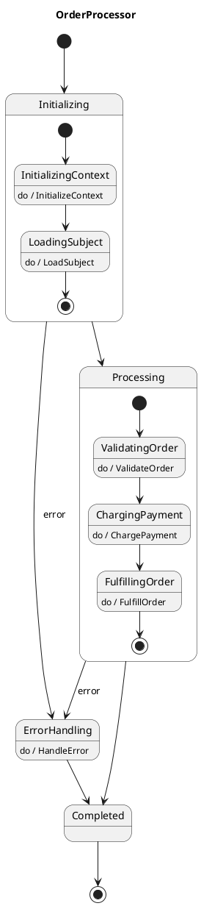

# Error Events Example

This example demonstrates the error event feature in VectorSigma, which provides
automatic error handling for composite states without requiring explicit
`IsError` guard checks.

## Overview

Error events allow you to define error transitions at the composite state level.
When any action within a composite state returns an error, the error event is
automatically triggered, transitioning to the specified error handling state.

## Benefits

1. **Cleaner UML diagrams**: No need for repetitive `IsError` guards on every
   state
2. **Centralized error handling**: Define error transitions once at the
   composite level
3. **Declarative error handling**: Express error flows as events in your state
   diagram
4. **Backward compatible**: Existing `IsError` guards continue to work

## How It Works

### Traditional Approach (IsError Guards)

```plantuml
state Initializing {
    InitializingContext: do / InitializeContext
    InitializingContext --> [*] : IsError
    InitializingContext --> LoadingSubject

    LoadingSubject: do / LoadSubject
    LoadingSubject --> [*] : IsError
    LoadingSubject --> [*]
}
```

### Error Event Approach

```plantuml
state Initializing {
    InitializingContext: do / InitializeContext
    InitializingContext --> LoadingSubject

    LoadingSubject: do / LoadSubject
    LoadingSubject --> [*]
}

Initializing --> ErrorHandling : error
```

## Example State Machine

The order processor example demonstrates a typical e-commerce order flow with
error handling:

1. **Initializing** - Initialize context and load order information
2. **Processing** - Validate order, charge payment, and fulfill
3. **ErrorHandling** - Handle any errors that occur
4. **Completed** - Final state

### UML Diagram



## Running the Example

```bash
# Run all tests
go test -v

# Run specific test
go test -run TestOrderProcessor_PaymentFailureTriggersErrorEvent -v

# Run benchmarks
go test -bench=. -benchmem
```

## Test Cases

1. **TestOrderProcessor_SuccessfulOrder** - Tests the happy path with no errors
2. **TestOrderProcessor_PaymentFailureTriggersErrorEvent** - Tests error
   handling when payment fails
3. **TestOrderProcessor_InitializationErrorTriggersErrorEvent** - Tests error
   handling during initialization

## Implementation Details

### Error Event Syntax

In your UML diagram, use the `error` keyword to define error transitions:

```plantuml
CompositState --> ErrorState : error
```

### Generated Code

VectorSigma generates:

1. An `ErrorTransition` field in `StateConfig`
2. Runtime checks for error transitions after composite state execution
3. Automatic transition to the error target when errors occur

### Behavior

- Errors are checked after a composite state completes
- If an `ErrorTransition` is defined, the state machine transitions to that
  state
- If no `ErrorTransition` is defined, the error is stored in
  `ExtendedState.Error` (backward compatible)
- All actions within a composite state run even if one fails (errors accumulate)

## Best Practices

1. Define error transitions at the composite state level for cleaner diagrams
2. Use error events for expected error conditions
3. Implement centralized error handling states
4. Initialize the `ExtendedState.Data` map in error handlers (it may be nil)
5. Log errors appropriately for debugging

## Backward Compatibility

The error event feature is fully backward compatible:

- Existing `IsError` guards continue to work
- States without error transitions behave as before
- You can mix error events and `IsError` guards in the same state machine
