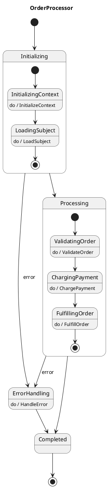

# Order Processing State Machine with Error Events

This example demonstrates error event handling in VectorSigma.



## Key Features

1. **Composite State Error Handling**: Both `Initializing` and `Processing` composite states have error event transitions
2. **Error Propagation**: When any action within a composite state fails, the error event is triggered
3. **Centralized Error Handling**: All errors route to the `ErrorHandling` state
4. **No IsError Guards Needed**: Clean, declarative error handling without verbose guard checks

## Comparison with Traditional Approach

### Traditional (IsError Guard):
```plantuml
InitializingContext: do / InitializeContext
InitializingContext --> [*] : IsError
InitializingContext --> LoadingSubject

LoadingSubject: do / LoadSubject
LoadingSubject --> [*] : IsError
LoadingSubject --> [*]
```

### With Error Events:
```plantuml
state Initializing {
    InitializingContext: do / InitializeContext
    InitializingContext --> LoadingSubject
    LoadingSubject: do / LoadSubject
    LoadingSubject --> [*]
}
Initializing --> ErrorHandling : error
```

The error event approach is cleaner and centralizes error handling at the composite state level.
