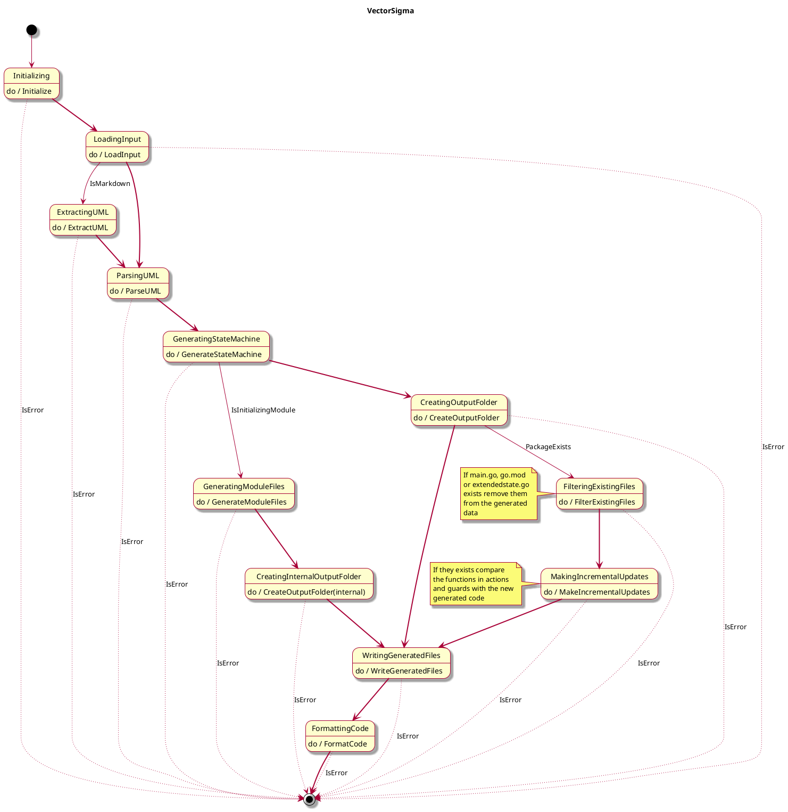

# VectorSigma

```plantuml
@startuml

skin rose

title VectorSigma

[*] --> Initializing

Initializing: do / Initialize
Initializing -[dotted]-> [*]: IsError
Initializing -[bold]-> LoadingInput

LoadingInput: do / LoadInput
LoadingInput -[dotted]-> [*]: IsError
LoadingInput --> ExtractingUML: IsMarkdown
LoadingInput -[bold]-> ParsingUML

ExtractingUML: do / ExtractUML
ExtractingUML -[dotted]-> [*]: IsError
ExtractingUML -[bold]-> ParsingUML

ParsingUML: do / ParseUML
ParsingUML -[dotted]-> [*]: IsError
ParsingUML -[bold]-> GeneratingStateMachine

GeneratingStateMachine: do / GenerateStateMachine
GeneratingStateMachine -[dotted]-> [*]: IsError
GeneratingStateMachine --> GeneratingModuleFiles: IsInitializingModule
GeneratingStateMachine -[bold]-> CreatingOutputFolder

GeneratingModuleFiles: do / GenerateModuleFiles
GeneratingModuleFiles -[dotted]-> [*]: IsError
GeneratingModuleFiles -[bold]-> CreatingInternalOutputFolder

CreatingInternalOutputFolder: do / CreateOutputFolder(internal)
CreatingInternalOutputFolder -[dotted]-> [*]: IsError
CreatingInternalOutputFolder -[bold]-> WritingGeneratedFiles

CreatingOutputFolder: do / CreateOutputFolder
CreatingOutputFolder -[dotted]-> [*]: IsError
CreatingOutputFolder --> FilteringExistingFiles: PackageExists
CreatingOutputFolder -[bold]-> WritingGeneratedFiles

FilteringExistingFiles: do / FilterExistingFiles
FilteringExistingFiles -[dotted]-> [*]: IsError
FilteringExistingFiles -[bold]-> MakingIncrementalUpdates
note left of FilteringExistingFiles
  If main.go, go.mod
  or extendedstate.go
  exists remove them
  from the generated
  data
end note

MakingIncrementalUpdates: do / MakeIncrementalUpdates
MakingIncrementalUpdates -[dotted]-> [*]: IsError
MakingIncrementalUpdates -[bold]-> WritingGeneratedFiles
note left of MakingIncrementalUpdates
  If they exists compare
  the functions in actions
  and guards with the new
  generated code
end note


WritingGeneratedFiles: do / WriteGeneratedFiles
WritingGeneratedFiles -[dotted]-> [*]: IsError
WritingGeneratedFiles -[bold]-> FormattingCode

FormattingCode: do / FormatCode
FormattingCode -[dotted]-> [*]: IsError
FormattingCode -[bold]-> [*]

@enduml

```

